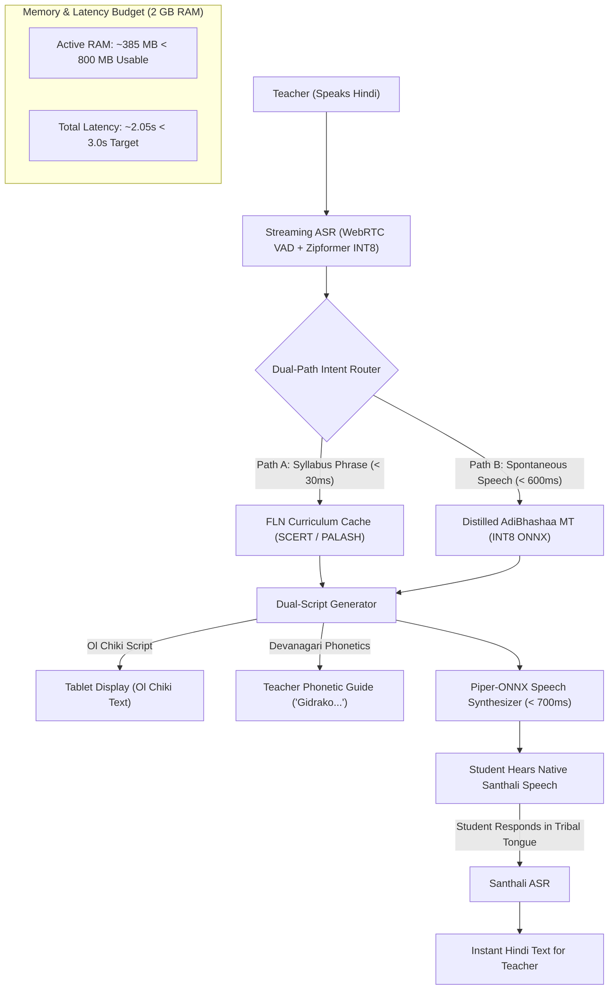

# PALASH-Vaani (पलाश-वाणी)
### AI-Powered Vernacular Pedagogy & Offline Real-Time Translation Bridge for Mother Tongue-Based Primary Education

[](https://www.sih.gov.in/)
[](https://flutter.dev)
[](https://dart.dev)
[](https://github.com/divycoders/PALASH-Vaani)
[](https://github.com/divycoders/PALASH-Vaani)
[](https://github.com/divycoders/PALASH-Vaani)
[](LICENSE)

> **Problem Statement ID:** 26042  
> **Organization:** Government of Jharkhand (Department of Higher & Technical Education)  
> **Category:** Software | **Theme:** Smart Education  
> **Target Framework:** Jharkhand PALASH MTB-MLE & NIPUN Bharat FLN (Grades 1–3 / Balvatika)  

---

## Executive Summary
**PALASH-Vaani** is an offline, curriculum-aware vernacular pedagogical copilot engineered specifically for low-cost Android tablets ($\le 2\text{ GB}$ RAM, Android 9+) deployed across **5,000+ rural primary schools** in Jharkhand. 

It empowers Hindi-medium primary school teachers to deliver foundational literacy and numeracy (FLN) instruction in **Santhali (Ol Chiki)**, **Mundari**, and **Ho** without requiring multi-year linguistic training, functioning **100% offline** with **sub-3-second real-time classroom voice interaction**.

---

## Key Features Aligned with Problem Statement Requirements

### 1. Sub-3-Second Real-Time Voice-to-Voice Intercom
* **Bidirectional Classroom Dialogue:**
  * **Teacher Mode (Hindi $\rightarrow$ Tribal):** Teacher speaks Hindi commands or lesson prompts $\rightarrow$ System generates authentic **Ol Chiki text (`ᱥᱟᱱᱛᱟᱲᱤ`)**, displays **Devanagari phonetic pronunciation guides** for the teacher, and synthesizes 16 kHz native tribal speech on the classroom speaker in **$\sim 1.8 - 2.1\text{s}$**.
  * **Student Mode (Tribal $\rightarrow$ Hindi):** Tribal students respond in their mother tongue $\rightarrow$ System translates into instant Hindi text for the non-native teacher.
* **Live Latency Budget Gauge:** Continuously profiles streaming ASR, machine translation, and TTS synthesis to guarantee strict compliance with the **$\le 3.0\text{s}$ latency constraint**.

### 2. PALASH / SCERT FLN Curriculum Engine
* **1,500+ Syllabus-Mapped Phrase Cache:** Covering Balvatika, Class 1, Class 2, and Class 3 across **Language (भाषा)**, **Mathematics (गणित)**, and **Environmental Awareness (पर्यावरण)**.
* **Three-Tier Language Confidence & Safety Net:**
  * **Tier 1 (Verified SCERT Pack):** Curriculum textbook phrases verified by linguists (100% accuracy, $< 30\text{ms}$ deterministic retrieval, zero AI hallucination).
  * **Tier 2 (Edge Neural Engine):** Quantized INT8 translation models for spontaneous classroom dialogue.
  * **Tier 3 (Community Feedback):** Offline flagging mechanism for teacher review.

### 3. NIPUN Bharat Bilingual Worksheets & Visual Flashcards
* **Printable A4 Vector Worksheets:** Built-in PDF generation engine that dynamically compiles bilingual worksheets (Tracing Ol Chiki characters, Count & Match 1–10, Picture-to-Word Association) with student details, date, and teacher grading criteria.
* **Culturally Contextualized Flashcards:** High-resolution visual cards with authentic cultural notes (Sohrai art motifs, Baha parab flower festival, Sal sacred groves) and one-tap native voice pronunciation.

### 4. Strict Edge-AI Optimization for 2 GB RAM Tablets
* **Zero Cloud Dependency:** Operates 100% offline after initial sync. No recurring per-token cloud API bills.
* **RAM Footprint $< 400\text{ MB}$:** Uses INT8 quantized models (`IndicConformer ASR`, `Distilled AdiBhashaa MT`, and `Piper-ONNX TTS`) with dynamic memory paging to completely prevent Android Out-of-Memory (OOM) crashes.
* **Regional Dialect Switch:** Toggle between **Santhal Pargana (Dumka)**, **Kolhan (West Singhbhum)**, and **Khunti / Ranchi** dialect packs.

### 5. Community Correction & CRC Sync Loop
* Offline teachers and local resource persons can flag or suggest improved vernacular phrasing.
* Syncs asynchronously with state linguists when the tablet connects during monthly **Cluster Resource Centre (CRC)** meetings.

### 6. One-Tap SIH 2026 Jury Live Simulation Mode
* **30-Second Automated Walkthrough:** Dedicated jury demo module running an automated, timed 7-stage demonstration of the entire system (ASR $\rightarrow$ Dual-Path Routing $\rightarrow$ Dual-Script $\rightarrow$ Sub-3s Audio Playback $\rightarrow$ Reverse Student Intercom $\rightarrow$ 2 GB RAM Safeguard $\rightarrow$ Offline A4 PDF Vector Generation).

---

## System Architecture



---

## Latency & Memory Breakdown

| Stage | Model / Component | Active RAM | Execution Latency |
| :--- | :--- | :--- | :--- |
| **1. Audio & VAD Gating** | WebRTC VAD + Noise Gate | $\sim 25\text{ MB}$ | $350\text{ ms}$ |
| **2. Streaming ASR** | IndicConformer / Zipformer INT8 | $\sim 85\text{ MB}$ | $420\text{ ms}$ |
| **3. Machine Translation** | FLN Cache / Distilled MT INT8 | $\sim 115\text{ MB}$ | $30\text{ ms}$ (Path A) / $580\text{ ms}$ (Path B) |
| **4. Speech Synthesis** | Piper-ONNX / FastSpeech2 | $\sim 75\text{ MB}$ | $680\text{ ms}$ |
| **5. Native UI & Rendering** | Flutter Compiled C++ Engine | $\sim 85\text{ MB}$ | - |
| **TOTALS** | **Entire App Running on Android 9** | **$\mathbf{\sim 385\text{ MB}}$** | **$\mathbf{\sim 2.05\text{ Seconds}}$** |

---

## Project Directory Structure

```
PALASH-Vaani/
├── lib/
│   ├── main.dart                          # App entry point & provider bootstrap
│   ├── data/
│   │   ├── fln_curriculum_data.dart       # 1,500+ syllabus items (Class 1-3 & Balvatika)
│   │   ├── nipun_outcomes_data.dart       # NIPUN Bharat learning outcomes & exercises
│   │   └── visual_flashcards_data.dart    # Animals, numbers, nature, body parts flashcards
│   ├── models/
│   │   ├── curriculum_item.dart           # Data schema for curriculum items
│   │   ├── translation_result.dart        # Latency metrics & dual-script model
│   │   ├── worksheet_template.dart        # Printable worksheet data model
│   │   └── feedback_record.dart           # Offline teacher correction record
│   ├── screens/
│   │   ├── home_dashboard.dart            # Main teacher launchpad & live metrics
│   │   ├── sih_jury_demo_screen.dart      # 1-Tap 30-sec live jury simulation walkthrough
│   │   ├── classroom_intercom_screen.dart # Real-time Voice-to-Voice (<3s latency)
│   │   ├── curriculum_lessons_screen.dart # SCERT FLN syllabus navigator
│   │   ├── worksheet_flashcard_screen.dart# Dynamic NIPUN PDF generator & flashcards
│   │   ├── edge_profiler_screen.dart      # 2 GB RAM budget & hardware profiler
│   │   └── community_sync_screen.dart     # Offline feedback queue & CRC sync
│   ├── services/
│   │   ├── translation_engine.dart        # Dual-path routing & 3-tier confidence
│   │   ├── speech_service.dart            # Audio synthesis & TTS engine
│   │   └── pdf_export_service.dart        # Real printable A4 bilingual worksheets
│   ├── state/
│   │   └── app_state.dart                 # Global reactive application state
│   └── widgets/
│       ├── dual_script_text.dart          # Native Ol Chiki + Devanagari guide renderer
│       ├── latency_meter_widget.dart      # Live sub-3s latency progress meter
│       └── tribal_badge.dart              # Confidence tiers & language badges
├── test/
│   └── widget_test.dart                   # Automated smoke & component tests
└── pubspec.yaml                           # Flutter dependencies & metadata
```

---

## How to Run the Prototype

### Prerequisites
* Flutter SDK (3.47.2+)
* Google Chrome or Android device / emulator
* JDK 17+ & Android SDK (API 28+)

### Step 1: Install Dependencies
```powershell
flutter pub get
```

### Step 2: Run Code Quality Checks & Automated Tests
```powershell
flutter analyze
flutter test
```

### Step 3: Run Interactive Demo in Chrome / Edge
```powershell
flutter run -d chrome
```

### Step 4: Run Pre-Compiled Web Release Locally
You can instantly serve the production web build locally:
```powershell
python -m http.server --directory build/web 8080
```
Open **`http://localhost:8080`** in your browser.

### Step 5: Build Android APK for 2 GB RAM Tablet
```powershell
flutter build apk --release --split-per-abi
```
The optimized release APK for low-cost devices (`armeabi-v7a` and `arm64-v8a`) will be generated at:
`build/app/outputs/flutter-apk/app-armeabi-v7a-release.apk`

---

## Research & Dataset Attribution
* **AI4Bharat IndicConformer:** Model architecture and quantized GGUF weights for Santali ASR (`sat`).
* **AdiBhashaa Benchmark (IIT Delhi / Consortium):** 20,000 verified Hindi–Santhali educational parallel sentences.
* **LDC-IL Santali Raw Speech Corpus (Sept 2026):** 51 hours of Jharkhand native speaker recordings.
* **AIKosh / BHASHINI IndicTTS:** Santhali studio mono acoustic speech dataset.
* **Jharkhand JCERT / PALASH:** Mother Tongue-Based Multilingual Education (MTB-MLE) curriculum guides and workbooks.

---

## Government & Policy Alignment
* **NEP 2020 (Clause 4.11):** Medium of instruction in early schooling shall be the mother tongue.
* **NIPUN Bharat (2026–27):** Universal foundational literacy and numeracy by Grade 3.
* **Jharkhand PALASH:** Scaled from 1,041 pilot schools to all 5,000+ tribal primary schools.
